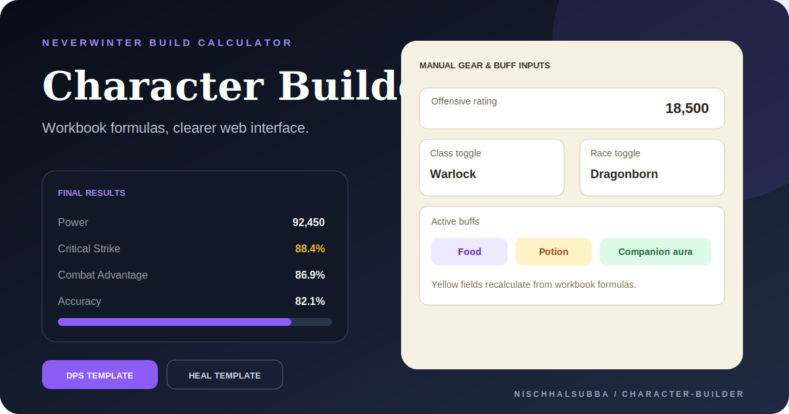

<div align="center">



# Neverwinter Character Builder Web

### Workbook-driven stat and damage calculator with a clearer browser interface

A static web calculator generated from `NW Char Builder.xlsx`. It preserves the workbook's manual inputs, source sheets, important cell addresses, and formula dependencies while organizing them into web-friendly sections.


[Repository instructions](./AGENTS.md)

</div>

## Product direction

The project should behave like the Excel workbook without visually cloning it.

The user manually enters ratings, gear bonuses, buffs, class and race toggles, and miscellaneous values. The browser formula engine then recalculates derived results and lets the user inspect the original formula behind calculated fields.

## Main sections

- Final Results
- Manual Gear and Stat Bonuses
- Damage Estimator
- Self and Team Buffs
- Class and Race Toggles
- Misc Values

## Workbook templates

| Sheet | Purpose |
|---|---|
| README | Original workbook instructions |
| DPS Template | General DPS ratings and damage calculation |
| MSOD DPS Template | MSOD-specific DPS calculation |
| HEAL Template | Healer stat calculation |
| TANK Template | Tank stat calculation |

## Formula support

The browser calculator currently supports:

- cell references such as `B4`, `C18`, and `R14`
- ranges such as `C4:R4`
- arithmetic operators
- `SUM()`
- `MIN()`
- `ROUND()`
- Boolean toggles represented as `1` or `0`

Calculated fields remain locked and can expose the original workbook formula for traceability.

## Asset system

`src/assets.js` is the central icon map.

- buff, aura, food, and companion icons can be embedded as WebP data URIs
- class and race icons use the same map
- unknown labels fall back to readable initials
- `labelWithIcon()` and `iconHtml()` render icon-enhanced labels

## Run locally

```bash
python -m http.server 5173
```

Open:

```text
http://localhost:5173
```

## GitHub Pages

The project can be served directly from the repository root:

```text
Settings → Pages → Deploy from branch → main → /root
```

Verify asset paths after deployment.

## Current status

| Area | Status |
|---|---|
| Workbook-derived templates | Present |
| Manual stat inputs | Implemented |
| Formula evaluation | Implemented for documented formula types |
| Formula inspection | Implemented |
| Icon mapping and fallbacks | Implemented |
| JSON import/export | Documented |
| Automated workbook regression tests | Not confirmed |
| Current-patch data verification | Required |
| Fresh browser screenshot | Not captured in this pass |

The repository thumbnail is a designed presentation asset based on the actual calculator workflow. It is not a browser screenshot.

## Important limitations

- Neverwinter ratings, buffs, classes, races, and item effects can change after patches.
- The web calculator is independent and is not affiliated with the game's rights holders.
- Unsupported workbook formulas must be identified explicitly.
- Results should be compared against known workbook fixtures before release.

## Recommended next work

1. Add regression fixtures from each workbook template.
2. Test formula parser edge cases.
3. Add source and patch-verification dates to game constants.
4. Add accessibility labels and keyboard review.
5. Capture real desktop and mobile screenshots after deployment verification.

## Author

Maintained by Nischhal Raj Subba.