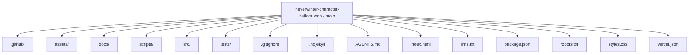
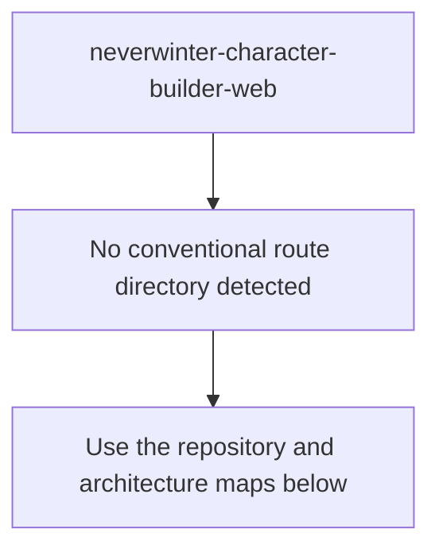
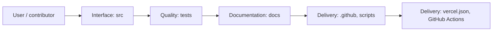
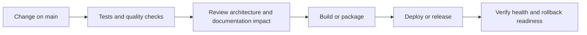
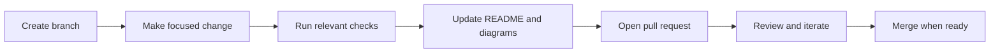

<!-- interactive-readme-standard:start -->

<div align="center">

# neverwinter-character-builder-web

**Branch-aware technical guide for [`main`](https://github.com/Nischhalsubba/neverwinter-character-builder-web/tree/main)**

<p>    </p>

<p>
  <a href="https://github.com/Nischhalsubba/neverwinter-character-builder-web/tree/main"><strong>Browse source</strong></a> ·
  <a href="https://github.com/Nischhalsubba/neverwinter-character-builder-web/issues"><strong>Issues</strong></a> ·
  <a href="https://github.com/Nischhalsubba/neverwinter-character-builder-web/codespaces/new?ref=main"><strong>Open in Codespaces</strong></a>
</p>

</div>

> [!IMPORTANT]
> This guide is generated from the files actually present on `main`. It links to detected source paths, preserves project-authored notes, and avoids claiming components that were not found.

## At a glance

| Item | Detected value |
|---|---|
| Purpose | Static web version of a Neverwinter Excel character builder with DPS, Heal, and Tank calculators. |
| Branch role | Default branch |
| Stack | JavaScript, HTML, CSS |
| Manifests | package.json |
| Prerequisites | Node.js |
| Delivery | vercel.json, GitHub Actions |
| License | No license file detected |

## Branch scope

This is the repository's default branch.


## Quick start

```bash
npm install
npm run start
npm run build
npm run test
```

### Configuration surface

- No committed environment example file was detected.

> Never commit secrets, private keys, production credentials, customer data, or unredacted infrastructure details.

## Repository map


```mermaid
flowchart TD
    ROOT["neverwinter-character-builder-web / main"]
    ROOT --> P0[".github/"]
    ROOT --> P1["assets/"]
    ROOT --> P2["docs/"]
    ROOT --> P3["scripts/"]
    ROOT --> P4["src/"]
    ROOT --> P5["tests/"]
    ROOT --> P6[".gitignore"]
    ROOT --> P7[".nojekyll"]
    ROOT --> P8["AGENTS.md"]
    ROOT --> P9["index.html"]
    ROOT --> P10["llms.txt"]
    ROOT --> P11["package.json"]
    ROOT --> P12["robots.txt"]
    ROOT --> P13["styles.css"]
    ROOT --> P14["vercel.json"]
```

| Responsibility | Detected source paths |
|---|---|
| Interface | [`src`](https://github.com/Nischhalsubba/neverwinter-character-builder-web/tree/main/src) |
| Quality | [`tests`](https://github.com/Nischhalsubba/neverwinter-character-builder-web/tree/main/tests) |
| Documentation | [`docs`](https://github.com/Nischhalsubba/neverwinter-character-builder-web/tree/main/docs) |
| Delivery | [`.github`](https://github.com/Nischhalsubba/neverwinter-character-builder-web/tree/main/.github), [`scripts`](https://github.com/Nischhalsubba/neverwinter-character-builder-web/tree/main/scripts) |

## Website or application map


```mermaid
flowchart TD
    APP["neverwinter-character-builder-web"]
    APP --> SOURCE["No conventional route directory detected"]
    SOURCE --> GUIDE["Use the repository and architecture maps below"]
```

## Architecture and responsibility flow


```mermaid
flowchart LR
    USER["User / contributor"]
    USER --> A0["Interface: src"]
    A0 --> A1["Quality: tests"]
    A1 --> A2["Documentation: docs"]
    A2 --> A3["Delivery: .github, scripts"]
    A3 --> DELIVERY["Delivery: vercel.json, GitHub Actions"]
```


## Quality, security, and operations

<table>
<tr>
<td width="33%" valign="top">

### Quality

- [`tests`](https://github.com/Nischhalsubba/neverwinter-character-builder-web/tree/main/tests)

Detected commands:
- `npm run start`
- `npm run build`
- `npm run test`

</td>
<td width="33%" valign="top">

### Security

- No dedicated security policy or automated dependency configuration was detected.

Review authentication, authorization, input validation, dependency updates, secret handling, and failure recovery before release.

</td>
<td width="34%" valign="top">

### Observability

- No dedicated observability integration was detected automatically.

Define useful logs, metrics, traces, alerts, and rollback signals for production-facing branches.

</td>
</tr>
</table>

## Delivery flow


```mermaid
flowchart LR
    CHANGE["Change on main"] --> CHECK["Tests and quality checks"]
    CHECK --> REVIEW["Review architecture and documentation impact"]
    REVIEW --> BUILD["Build or package"]
    BUILD --> DEPLOY["Deploy or release"]
    DEPLOY --> VERIFY["Verify health and rollback readiness"]
```

### Automation detected

- [`.github/workflows/apply-interactive-readme.yml`](https://github.com/Nischhalsubba/neverwinter-character-builder-web/blob/main/.github/workflows/apply-interactive-readme.yml)
- [`.github/workflows/verify-formulas.yml`](https://github.com/Nischhalsubba/neverwinter-character-builder-web/blob/main/.github/workflows/verify-formulas.yml)

## Contribution flow


```mermaid
flowchart LR
    FORK["Create branch"] --> CHANGE["Make focused change"]
    CHANGE --> TEST["Run relevant checks"]
    TEST --> DOCS["Update README and diagrams"]
    DOCS --> PR["Open pull request"]
    PR --> REVIEW["Review and iterate"]
    REVIEW --> MERGE["Merge when ready"]
```

- Keep changes focused and explain architectural consequences.
- Run the checks relevant to the changed area.
- Update diagrams whenever routes, modules, data models, authentication, jobs, or delivery paths change.
- Add screenshots or recordings for visual behavior changes when useful.
- Use issues for reproducible defects and pull requests for reviewable changes.

## Ownership and support

| Topic | Source |
|---|---|
| Repository | [`Nischhalsubba/neverwinter-character-builder-web`](https://github.com/Nischhalsubba/neverwinter-character-builder-web) |
| Branch | [`main`](https://github.com/Nischhalsubba/neverwinter-character-builder-web/tree/main) |
| Ownership | No CODEOWNERS file detected |
| Contributing | Use the contribution flow above |
| Support | [Open or review issues](https://github.com/Nischhalsubba/neverwinter-character-builder-web/issues) |
| License | No license file detected |

<details>
<summary><strong>Documentation maintenance checklist</strong></summary>

- [ ] Purpose and branch scope are accurate.
- [ ] Setup and configuration commands still work.
- [ ] Repository, application, API, data, authentication, job, and deployment diagrams match the code.
- [ ] Tests, security controls, observability, and rollback behavior are documented.
- [ ] Links point to real files on this branch.
- [ ] No secrets or private operational details are exposed.

</details>

<!-- interactive-readme-standard:end -->

<!-- project-authored-notes:start -->
<details>
<summary><strong>Project-authored notes preserved from this branch</strong></summary>

<div align="center">


# Neverwinter Character Builder Web

### Workbook-driven stat and damage calculator with a clearer browser interface

A static web calculator generated from `NW Char Builder.xlsx`. It preserves the workbook's manual inputs, source sheets, important cell addresses, and formula dependencies while organizing them into web-friendly sections.


[Repository instructions](./AGENTS.md)

</div>

## Product direction

The project should behave like the Excel workbook without visually cloning it.

The user manually enters ratings, gear bonuses, buffs, class and race toggles, and miscellaneous values. The browser formula engine then recalculates derived results and lets the user inspect the original formula behind calculated fields.

## Main sections

- Final Results
- Manual Gear and Stat Bonuses
- Damage Estimator
- Self and Team Buffs
- Class and Race Toggles
- Misc Values

## Workbook templates

| Sheet | Purpose |
|---|---|
| README | Original workbook instructions |
| DPS Template | General DPS ratings and damage calculation |
| MSOD DPS Template | MSOD-specific DPS calculation |
| HEAL Template | Healer stat calculation |
| TANK Template | Tank stat calculation |

## Formula support

The browser calculator currently supports:

- cell references such as `B4`, `C18`, and `R14`
- ranges such as `C4:R4`
- arithmetic operators
- `SUM()`
- `MIN()`
- `ROUND()`
- Boolean toggles represented as `1` or `0`

Calculated fields remain locked and can expose the original workbook formula for traceability.

## Asset system

`src/assets.js` is the central icon map.

- buff, aura, food, and companion icons can be embedded as WebP data URIs
- class and race icons use the same map
- unknown labels fall back to readable initials
- `labelWithIcon()` and `iconHtml()` render icon-enhanced labels

## Run locally

```bash
python -m http.server 5173
```

Open:

```text
http://localhost:5173
```

## GitHub Pages

The project can be served directly from the repository root:

```text
Settings → Pages → Deploy from branch → main → /root
```

Verify asset paths after deployment.

## Current status

| Area | Status |
|---|---|
| Workbook-derived templates | Present |
| Manual stat inputs | Implemented |
| Formula evaluation | Implemented for documented formula types |
| Formula inspection | Implemented |
| Icon mapping and fallbacks | Implemented |
| JSON import/export | Documented |
| Automated workbook regression tests | Not confirmed |
| Current-patch data verification | Required |
| Fresh browser screenshot | Not captured in this pass |

The repository thumbnail is a designed presentation asset based on the actual calculator workflow. It is not a browser screenshot.

## Important limitations

- Neverwinter ratings, buffs, classes, races, and item effects can change after patches.
- The web calculator is independent and is not affiliated with the game's rights holders.
- Unsupported workbook formulas must be identified explicitly.
- Results should be compared against known workbook fixtures before release.

## Recommended next work

1. Add regression fixtures from each workbook template.
2. Test formula parser edge cases.
3. Add source and patch-verification dates to game constants.
4. Add accessibility labels and keyboard review.
5. Capture real desktop and mobile screenshots after deployment verification.

## Author

Maintained by Nischhal Raj Subba.

</details>
<!-- project-authored-notes:end -->
